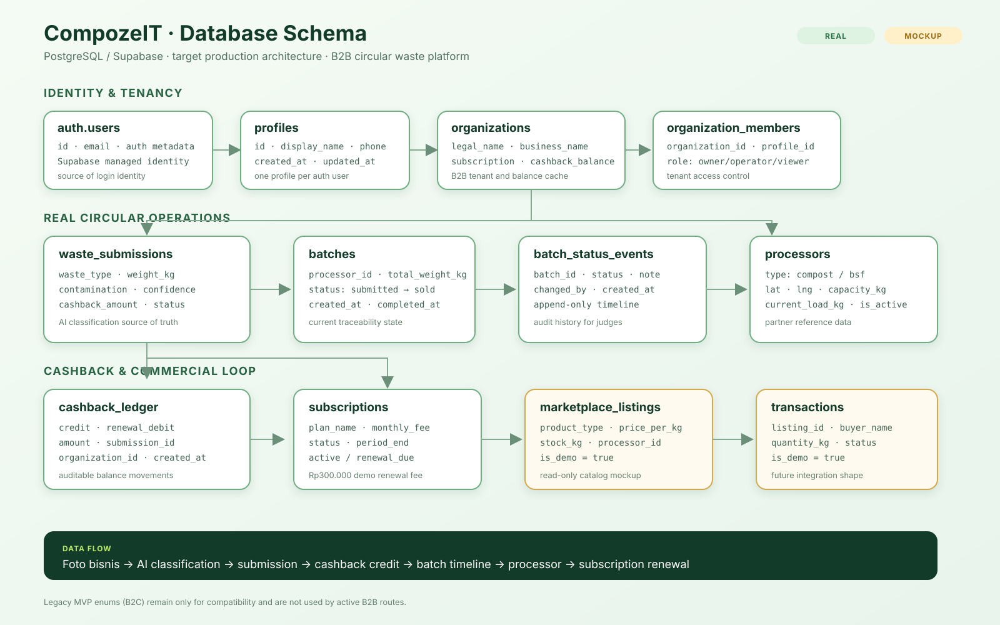
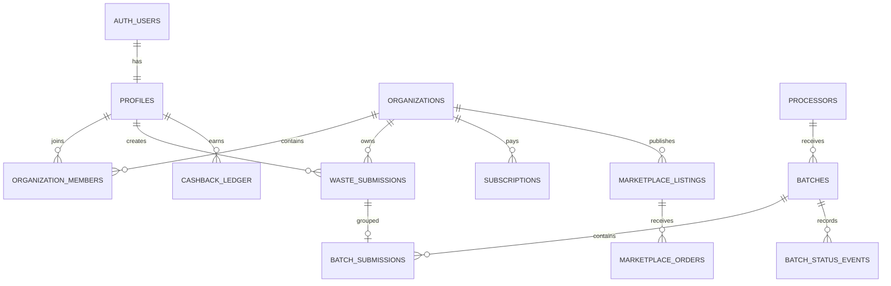

# CompozeIT Database Schema

Dokumen ini adalah rancangan target PostgreSQL/Supabase untuk CompozeIT. Ia menjelaskan batas antara data operasional yang REAL dan data tampilan yang MOCKUP, sehingga mudah dibaca saat presentasi juri. **Ini adalah target production schema, belum seluruhnya dipakai aplikasi saat ini.** Schema aktif demo tetap berada di `supabase/seed.sql`.

## 1. Prinsip desain

- PostgreSQL menjadi sumber kebenaran untuk klasifikasi sampah, cashback, dan traceability.
- Supabase Auth menyimpan identitas login. Database aplikasi hanya menyimpan profile dan relasi bisnis.
- Semua nilai uang disimpan dalam `numeric` dengan satuan Rupiah, bukan floating point.
- Semua berat disimpan dalam kilogram dengan dua angka desimal.
- Status proses disimpan sebagai event append-only dan status terkini pada tabel induk agar query dashboard cepat.
- Marketplace dan logistics tetap memakai data seed atau fixture. Keduanya tidak diklaim sebagai transaksi atau GPS real-time.
- Fungsi yang mengubah saldo cashback berjalan dalam transaksi database dan mengunci baris user untuk mencegah saldo ganda.

## 2. Entity relationship diagram

Versi gambar siap presentasi: [database-schema-erd.svg](./database-schema-erd.svg)





## 3. Table groups

### Identity and tenancy

| Table | Purpose | Real or mockup |
| --- | --- | --- |
| `auth.users` | Supabase managed login identity | Real |
| `profiles` | Display name, role, and audit metadata | Real |
| `organizations` | B2B business tenant | Real |
| `organization_members` | Many-to-many membership and role | Real |

### Circular operations

| Table | Purpose | Real or mockup |
| --- | --- | --- |
| `waste_submissions` | AI result, contamination, weight, and cashback amount | Real |
| `processors` | Compost or BSF processing partner | Real reference data |
| `batches` | Group of submissions sent to a processor | Real |
| `batch_submissions` | Batch to submission junction | Real |
| `batch_status_events` | Immutable traceability timeline | Real |

### Commercial loop

| Table | Purpose | Real or mockup |
| --- | --- | --- |
| `cashback_ledger` | Double-entry-like credit and debit history | Real |
| `subscriptions` | B2B renewal state and fee | Real simulation |
| `marketplace_listings` | Example compost and BSF catalog | Mockup / seed |
| `transactions` | Example order shape for future integration | Mockup / seed |

## 4. Canonical columns and constraints

### `profiles`

```text
id                 uuid primary key references auth.users(id)
display_name       text not null
phone              text nullable
created_at         timestamptz not null default now()
updated_at         timestamptz not null default now()
```

### `organizations`

```text
id                 uuid primary key default gen_random_uuid()
legal_name         text not null
business_name      text not null
subscription_status text not null check (subscription_status in ('active', 'renewal_due'))
cashback_balance   numeric(12,2) not null default 0 check (cashback_balance >= 0)
location_lat       double precision nullable check (location_lat between -90 and 90)
location_lng       double precision nullable check (location_lng between -180 and 180)
created_at         timestamptz not null default now()
updated_at         timestamptz not null default now()
```

`cashback_balance` adalah cache cepat untuk dashboard. Sumber auditnya tetap `cashback_ledger`.

### `organization_members`

```text
organization_id    uuid references organizations(id) on delete cascade
profile_id         uuid references profiles(id) on delete cascade
role               text not null check (role in ('owner', 'operator', 'viewer'))
created_at         timestamptz not null default now()
primary key (organization_id, profile_id)
```

### `waste_submissions`

```text
id                 uuid primary key default gen_random_uuid()
organization_id    uuid not null references organizations(id)
created_by         uuid not null references profiles(id)
photo_path         text nullable
waste_type         text not null check (waste_type in ('nasi', 'sayur', 'protein', 'buah', 'campuran', 'lainnya'))
estimated_weight_kg numeric(10,2) not null check (estimated_weight_kg > 0)
cashback_amount    numeric(12,2) not null default 0 check (cashback_amount >= 0)
is_contaminated    boolean not null default false
contaminant_type   text nullable check (contaminant_type in ('plastik', 'logam', 'kaca', 'lainnya'))
confidence         numeric(4,3) nullable check (confidence between 0 and 1)
ai_provider        text nullable
status             text not null default 'pending'
                   check (status in ('pending', 'pickup_scheduled', 'picked_up', 'processing', 'completed'))
created_at         timestamptz not null default now()
updated_at         timestamptz not null default now()
check ((is_contaminated = false and contaminant_type is null) or is_contaminated = true)
```

Asumsi bisnis: `cashback_amount = estimated_weight_kg * 1000`, yaitu Rp1.000 per kilogram.

### `processors`

```text
id                 uuid primary key default gen_random_uuid()
name               text not null
processor_type     text not null check (processor_type in ('compost', 'bsf'))
latitude           double precision not null check (latitude between -90 and 90)
longitude          double precision not null check (longitude between -180 and 180)
capacity_kg        numeric(12,2) not null check (capacity_kg > 0)
current_load_kg    numeric(12,2) not null default 0 check (current_load_kg >= 0)
is_active          boolean not null default true
created_at         timestamptz not null default now()
updated_at         timestamptz not null default now()
```

### `batches` and `batch_status_events`

```text
-- batches
id                 uuid primary key default gen_random_uuid()
processor_id       uuid not null references processors(id)
total_weight_kg    numeric(12,2) not null check (total_weight_kg > 0)
status             text not null default 'submitted'
                   check (status in ('submitted', 'picked_up', 'processing', 'completed', 'sold'))
created_at         timestamptz not null default now()
completed_at       timestamptz nullable

-- batch_status_events
id                 uuid primary key default gen_random_uuid()
batch_id           uuid not null references batches(id) on delete cascade
status             text not null check (status in ('submitted', 'picked_up', 'processing', 'completed', 'sold'))
note               text nullable
changed_by         uuid nullable references profiles(id)
created_at         timestamptz not null default now()
```

Status terkini berada di `batches.status`. Histori lengkap yang ditampilkan pada timeline berasal dari `batch_status_events` dan tidak boleh dihapus oleh user biasa.

### `batch_submissions`

```text
batch_id           uuid not null references batches(id) on delete cascade
submission_id      uuid not null references waste_submissions(id)
primary key (batch_id, submission_id)
```

### `cashback_ledger`

```text
id                 uuid primary key default gen_random_uuid()
organization_id    uuid not null references organizations(id)
submission_id      uuid nullable references waste_submissions(id)
entry_type         text not null check (entry_type in ('credit', 'renewal_debit', 'adjustment'))
amount             numeric(12,2) not null check (amount > 0)
description        text not null
created_by         uuid nullable references profiles(id)
created_at         timestamptz not null default now()
```

Satu submission hanya boleh menghasilkan satu credit melalui unique partial index pada `submission_id` untuk `entry_type = 'credit'`.

### `subscriptions`

```text
id                 uuid primary key default gen_random_uuid()
organization_id    uuid not null references organizations(id)
plan_name          text not null default 'B2B Circular Basic'
monthly_fee        numeric(12,2) not null default 300000 check (monthly_fee > 0)
status             text not null check (status in ('active', 'renewal_due', 'cancelled'))
current_period_end date not null
created_at         timestamptz not null default now()
updated_at         timestamptz not null default now()
```

Rp300.000 per bulan adalah angka simulasi untuk demo renewal, bukan harga komersial final.

### `marketplace_listings` and `transactions`

```text
-- marketplace_listings
id                 uuid primary key default gen_random_uuid()
organization_id    uuid nullable references organizations(id)
processor_id       uuid not null references processors(id)
product_type       text not null check (product_type in ('compost', 'bsf'))
price_per_kg       numeric(12,2) not null check (price_per_kg >= 0)
stock_kg           numeric(12,2) not null default 0 check (stock_kg >= 0)
description        text nullable
is_demo            boolean not null default true
created_at         timestamptz not null default now()
updated_at         timestamptz not null default now()

-- transactions
id                 uuid primary key default gen_random_uuid()
listing_id         uuid not null references marketplace_listings(id)
buyer_name         text not null
buyer_contact      text not null
quantity_kg        numeric(12,2) not null check (quantity_kg > 0)
status             text not null default 'pending'
                   check (status in ('pending', 'confirmed', 'shipped', 'completed', 'cancelled'))
is_demo            boolean not null default true
created_at         timestamptz not null default now()
updated_at         timestamptz not null default now()
```

`is_demo` membuat batas mockup eksplisit. Tabel target memakai nama `transactions` agar konsisten dengan schema MVP dan `supabase/seed.sql`. Order marketplace tidak memengaruhi cashback atau saldo organisasi sampai integrasi komersial benar-benar dibuat.

## 5. Indexes

```sql
create index idx_members_profile on organization_members(profile_id);
create index idx_submissions_org_created on waste_submissions(organization_id, created_at desc);
create index idx_submissions_status on waste_submissions(status);
create index idx_batches_processor_status on batches(processor_id, status);
create index idx_batch_events_timeline on batch_status_events(batch_id, created_at);
create index idx_cashback_org_created on cashback_ledger(organization_id, created_at desc);
create index idx_listings_product_active on marketplace_listings(product_type, is_demo);
create unique index uq_submission_cashback_credit
  on cashback_ledger(submission_id)
  where entry_type = 'credit' and submission_id is not null;
```

## 6. Transaction rules

1. Classify AI membuat `waste_submissions`, lalu membuat satu `cashback_ledger.credit` dalam transaksi yang sama.
2. Setelah credit berhasil, `organizations.cashback_balance` diperbarui dari nilai sebelumnya + credit.
3. Renewal mengunci baris `organizations` dengan `select for update`, memeriksa saldo, membuat `renewal_debit`, lalu mengurangi balance.
4. Perubahan status batch memperbarui `batches.status` dan menambahkan satu `batch_status_events` dalam transaksi yang sama.
5. Tidak ada endpoint client yang boleh mengubah balance secara langsung. Perubahan harus lewat RPC atau server route dengan service role.

## 7. Row Level Security

- `profiles`: user hanya dapat membaca dan memperbarui profile miliknya sendiri.
- `organizations` dan `organization_members`: member dapat membaca organisasi yang diikutinya; hanya owner yang dapat mengubah data organisasi dan member.
- `waste_submissions`: member organisasi dapat membaca submission organisasi; operator dan owner dapat membuat; penghapusan dibatasi owner atau server.
- `batches` dan `batch_status_events`: member dapat membaca batch yang memuat submission organisasinya; status hanya dapat diubah melalui RPC admin/server.
- `cashback_ledger` dan `subscriptions`: member dapat membaca organisasi sendiri; insert dan debit hanya melalui server-side RPC.
- `processors` dan marketplace mockup: dapat dibaca publik; perubahan hanya service role atau admin.
- Storage bucket foto harus private. API mengeluarkan signed URL dengan masa berlaku pendek, bukan URL publik permanen.

## 8. Data flow yang dijelaskan ke juri

```text
Foto bisnis
  -> AI classification + contamination detection
  -> waste_submissions
  -> cashback_ledger credit (Rp1.000/kg)
  -> organizations.cashback_balance
  -> batch + batch_status_events
  -> processor reference data
  -> marketplace listing mockup
  -> subscription renewal memakai cashback
```

## 9. Hubungan dengan schema MVP saat ini

`supabase/seed.sql` masih dipakai untuk demo yang berjalan. Kolom `users`, `waste_submissions`, `batches`, dan tabel timeline di sana adalah bentuk MVP yang kompatibel dengan route sekarang. Dokumen ini adalah target evolusi production: `users` dipisah menjadi `profiles` dan `organizations`, saldo dipertegas dengan ledger, dan semua akses dibatasi RLS.

Enum `user_type ('b2b', 'b2c')` dan `track_type ('sell', 'diy', 'b2b')` pada schema MVP merupakan legacy compatibility. Route dan navigasi aktif hanya memakai B2B. Nilai legacy tidak dipakai untuk data baru dan akan dihapus pada migrasi terpisah setelah seluruh data lama dibackfill.

Bagian ini adalah design reference untuk juri dan arsitektur tim, bukan satu migration yang langsung dieksekusi. RLS dan aturan transaksi di atas harus diwujudkan dalam migration terpisah setelah kebutuhan autentikasi siap.

Migrasi ke target schema sebaiknya dilakukan bertahap setelah demo: buat tabel baru, backfill organisasi dari `users`, dual-write sementara pada route, verifikasi data, lalu hapus kolom legacy. Jangan menjalankan migrasi destruktif langsung pada database demo.
